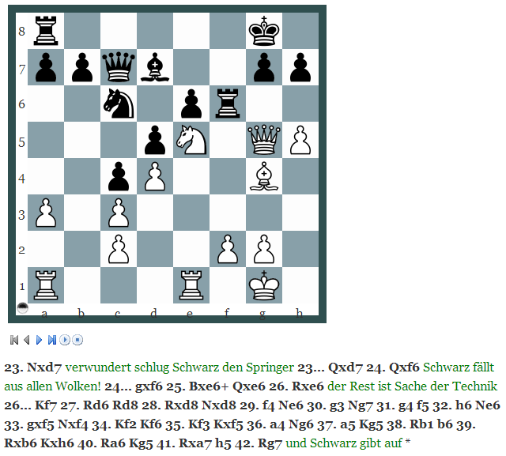
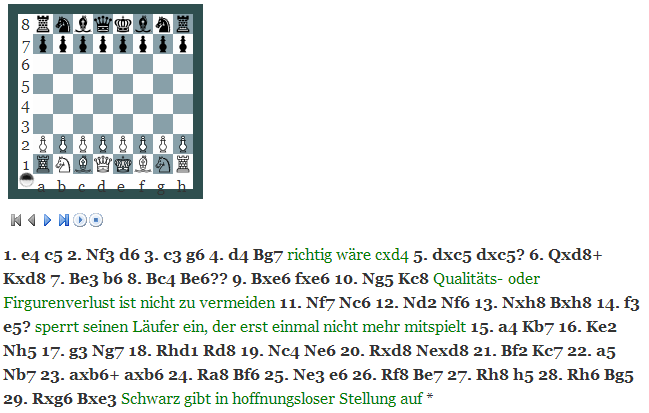
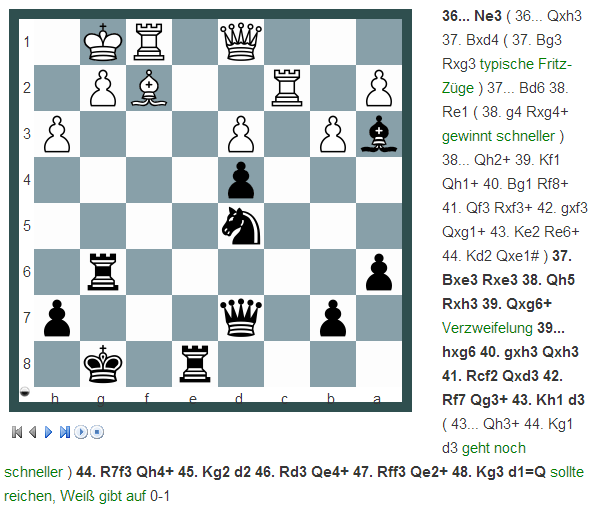

# ChessTempoViewer

## Plugin Metadata

* Contributors: mliebelt
* Tags: pgn,chess,chessboard
* Requires at least: 3.0.1
* Tested up to: 5.2.0
* Stable tag: 0.9.6
* License: GPLv2 or later
* License URI: http://www.gnu.org/licenses/gpl-2.0.html

Integrates the chess board of ChessTempo into WordPress. Pure implementation with most of the features of ChessTempo.

## Description

Integrate  the chess board of ChessTempo for some of the options).

See [ChessTempo PGN Viewer Usage](http://chesstempo.com/pgn-usage.html) for all the parameters available, this plugin
 only translates them to WordPress.

Use following tag to insert a chessboard:

`[ctpgn parameter=value ...]
... chess games in PGN format ...
[/ctpgn]`

Tag parameters:

 *   pgnFile: URL to the pgn file. If you want to embed the PGN directly, embed it like the example below. **(This parameter is not implemented yet)**
 *   pieceSet: possible are 'merida' (the default), 'leipzig', 'maya', 'condal', 'case' and 'kingdom'
 *   pieceSize: The size of the pieces to use in pixels, currently supported sizes are '20', '24', '29', '35', '40' and '46'. Default size is 46
 *   fen: The fen string if the game does not start from the beginning position
 *   movesFormat: The style of formatting for the moves display, either "default" or "main_on_own_line" for a
     display which puts the main line moves on their own line with the annotations/variations indented below the main line.
 *   layout: top (default), bottom, left or right. top means board is on top, moves below, bottom vice versae. left
     sets the board on the top left, and the moves flow on the right and below, right sets the board on the right, and moves
     flow on the left and below.
 *   id: name of the board on the page. Only necessary, if there is more than one board on the page. The names
     have to be unique per page, not globally.

Example:

`[ctpgn id=fen fen="r5k1/ppqb2pp/2n1pr2/3pN1QP/2pP2B1/P1P5/2P2PP1/R3R1K1 w - - 0 23"]
    23. Nxd7 {verwundert schlug Schwarz den Springer} Qxd7 24. Qxf6 {Schwarz fällt aus allen Wolken!} gxf6
    25. Bxe6+ Qxe6 26. Rxe6 {der Rest ist Sache der Technik} Kf7 27. Rd6 Rd8 28. Rxd8 Nxd8 29. f4 Ne6
    30. g3 Ng7 31. g4 f5 32. h6 Ne6 33. gxf5 Nxf4 34. Kf2 Kf6 35. Kf3 Kxf5 36. a4 Ng6 37. a5 Kg5
    38. Rb1 b6 39. Rxb6 Kxh6 40. Ra6 Kg5 41. Rxa7 h5 42. Rg7 {und Schwarz gibt auf} * [/ctpgn]`

## Installation

This section describes how to install the plugin and get it working.

e.g.

1. Upload `ChessTempoViewer.zip` to the `/wp-content/plugins/` directory, or install it directly from the admin plugins screen.
1. Activate the plugin through the 'Plugins' menu in WordPress.
1. Place `[ctpgn] <moves> [/ctpgn]` in your page

See the following examples for how to use it.

## Frequently Asked Questions

1. What is the minimal markup I have to use?

The minimal markup is (as an example):

`[ctpgn] 1. e4 e5 2. Nf3 Nc6 [/ctpgn]`

This will use the default values for pieceSet, pieceSize, movesFormat and id, and only works, if that board is the
only one on that WordPress page.

2. I don't see the metadata of the game?

This is not a feature of ChessTempo viewer, so it is ignored by him. I have not found a way to display it.

3. Why is the tag used so complicated?

I have choosen `ctpgn` (for ChessTempo PGN) because there are other plugins out like [Embed Chessboard](http://wordpress.org/plugins/embed-chessboard/)
that already use as markup `pgn` (which is the most natural one). It may be useful to have both plugins used on
the same page or on the same site, so I wanted to use a different tag name.

4. The plugin is not working for me.

There is a known problem if you use the theme Twentythirteen. See the question at [Stackoverflow](http://wordpress.stackexchange.com/questions/163334/how-to-disable-css-rule-in-twentythirteen-style-css) for details. At the end, we have
found a fix for that, so that the viewer is displayed correctly on all themes. Ensure to go to at least version 0.9.4.

## Screenshots 

1. Board from a special position, with most parameter (pieceSet, pieceSize) with default values.
2. Tiny board from the start position.
3. Layout variation with parameter layout == 'left'.

## Examples

The following examples show most of the features that are available.

First example with using a FEN string for the situation, and starting from there. Comments are given in braces.

`[ctpgn id=fen fen="r5k1/ppqb2pp/2n1pr2/3pN1QP/2pP2B1/P1P5/2P2PP1/R3R1K1 w - - 0 23"]
   23. Nxd7 {verwundert schlug Schwarz den Springer} Qxd7 24. Qxf6 {Schwarz fällt aus allen Wolken!} gxf6
   25. Bxe6+ Qxe6 26. Rxe6 {der Rest ist Sache der Technik} Kf7 27. Rd6 Rd8 28. Rxd8 Nxd8 29. f4 Ne6
   30. g3 Ng7 31. g4 f5 32. h6 Ne6 33. gxf5 Nxf4 34. Kf2 Kf6 35. Kf3 Kxf5 36. a4 Ng6 37. a5 Kg5
   38. Rb1 b6 39. Rxb6 Kxh6 40. Ra6 Kg5 41. Rxa7 h5 42. Rg7 {und Schwarz gibt auf} * [/ctpgn]`

Now a whole game, with only some comments.

`[ctpgn id=demo] 1. e4 c5 2. Nf3 d6 3. c3 g6 4. d4 Bg7 {richtig wäre cxd4} 5. dxc5 dxc5 $2 6. Qxd8+ Kxd8 7. Be3 b6
8. Bc4 Be6 $4 9. Bxe6 fxe6 10. Ng5 Kc8 {Qualitäts- oder Firgurenverlust ist nicht zu vermeiden}
11. Nf7 Nc6 12. Nd2 Nf6 13. Nxh8 Bxh8 14. f3 e5 $2 {sperrt seinen Läufer ein, der erst einmal nicht mehr mitspielt}
15. a4 Kb7 16. Ke2 Nh5 17. g3 Ng7 18. Rhd1 Rd8 19. Nc4 Ne6 20. Rxd8 Nexd8 21. Bf2 Kc7 22. a5 Nb7 23. axb6+ axb6
24. Ra8 Bf6 25. Ne3 e6 26. Rf8 Be7 27. Rh8 h5 28. Rh6 Bg5 29. Rxg6 Bxe3 {Schwarz gibt in hoffnungsloser Stellung auf} * [/ctpgn]`

Again the finish of a game with the result. See the variations with their syntax, they are tricky (at the moment).

`[ctpgn id=markus fen="4r1k1/1p1q3p/p5r1/3n4/3p4/bP1P3P/P1R2BP1/3Q1RK1 b - - 0 36"]
36. .. Ne3 ( 36. .. Qxh3 37. Bxd4 (37. Bg3 Rxg3 {typische Fritz-Züge}) 37. .. Bd6 38. Re1
(38.  g4 Rxg4+ {gewinnt schneller}) 38. .. Qh2+ 39. Kf1 Qh1+ 40. Bg1 Rf8+ 41. Qf3 Rxf3+ 42. gxf3 Qxg1+
43. Ke2 Re6+ 44. Kd2 Qxe1#) 37. Bxe3 Rxe3 38. Qh5 Rxh3 39.  Qxg6+ {Verzweifelung} hxg6
40. gxh3 Qxh3 41. Rcf2 Qxd3 42. Rf7 Qg3+ 43. Kh1 d3 (43. .. Qh3+ 44. Kg1 d3 {geht noch schneller})
44. R7f3 Qh4+ 45. Kg2 d2 46. Rd3 Qe4+ 47. Rff3 Qe2+ 48. Kg3 d1=Q {sollte reichen, Weiß gibt auf} 0-1 [/ctpgn]`

## Changelog

### 0.9.6

* Use https to download all external files. This avoids errors when serving the plugin with https.

### 0.9.5

* Added localization to use the language characters of the blogs language.
* Supported languages are: en_US, de_DE, fr_FR, pt_BR, es_ES.
* Files are located under: http://chesstempo.com/locale/es_ES/LC_MESSAGES/ct.json, so you can search there for additional ones.
* See my [Stackoverflow question](http://wordpress.stackexchange.com/questions/163473/where-does-the-locale-come-from) for details.

### 0.9.4

* Fixed the nasty bug with display of the board in theme Twentythirteen, thanks a lot to Mars and his
[answer on Stackoverflow](http://wordpress.stackexchange.com/a/163337/42578).

### 0.9.3

* Fixed the version problem, so that the plugin is now found with the correct version, and does not warn that there is an update (version 1.0)

### 0.9.2

* Added layout parameter with options top, bottom, left or right.

### 0.9.1

* Corrected some documentation errors.
* Completed the `readme.txt`.

### 0.9.0

* First published version, mostly feature complete.
* Missing: pgnFile as alternative to embedding the moves.

## Upgrade Notice

### 0.9.6

No upgrade notice necessary.

### 0.9.5

See if you can choose the correct language for your word press installation. Localizations are at least available for
English, German, French, Portuguese. The localization is then set in the header of the rendered HTML (2nd line).

### 0.9.2

No backward incompatible change, the new layout paramter has the same default as before.
